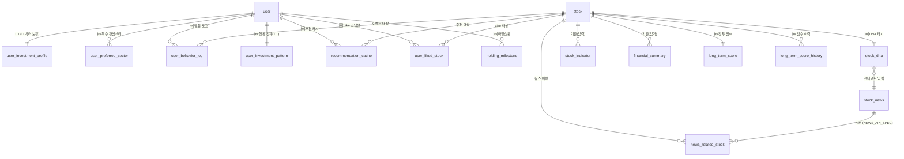

# 추천 알고리즘 DB 최적화 명세서 (ALGORITHM_DB_OPTIMIZATION_SPEC)

> 작성일: 2026-05-31
> 목적: 정율(Algo)이 설계한 **궁합 기반 온보딩 추천** + **장투 지원 알고리즘**을 실제로 구현·운영할 수 있도록 팀 DB 스키마의 **누락 컬럼/테이블/인덱스를 도출**하고, DBeaver에서 바로 실행 가능한 마이그레이션을 제공한다.
> 관련 문서: [`ERD.md`](./ERD.md) (진실의 원천) · [`DART_COLUMN.md`](./DART_COLUMN.md) (입력 지표) · [`NEWS_API_SPEC.md`](./NEWS_API_SPEC.md) (센티멘트 소스)
> 알고리즘 출처: `recommend_algorithm/before0525.md`, `기존알고리즘_기획안.md`, `기존알고리즘에_추가할장투로직.md`

---

## ⚠️ 선행 분석 결과 (작성 전 읽은 파일)

| 항목 | 결과 |
|---|---|
| DB 스키마(ERD) 읽기 | ✅ `docs/ERD.md` — 사용자/종목/거래/추천/커뮤니티 5도메인 전체 확인 |
| 재무·시장 지표 컬럼 사전 | ✅ `docs/DART_COLUMN.md` — `STOCK_INDICATOR`/`FINANCIAL_SUMMARY` 컬럼 의미·계산식 확인 |
| 온보딩 추천 알고리즘 | ✅ `recommend_algorithm/before0525.md`, `기존알고리즘_기획안.md` — 궁합 점수 5요소 공식 확인 |
| 장투 추천 알고리즘 | ✅ `기존알고리즘에_추가할장투로직.md`, `before0525.md` §12 — 재검증 4지표·하락 심리지원·마일스톤 확인 |
| 실제 DDL/마이그레이션 | ⚠️ 없음. `backend/`는 `config/`만 셋업(도메인 앱 미생성). **`ERD.md`가 스키마 진실의 원천**이며 본 문서 DDL은 ERD 컨벤션(`int PK`/`snake_case`/`created_at·updated_at`)을 따른다 |

> ⚠️ **가정 (PK)**: ERD 전체가 `int PK`(SERIAL/BIGSERIAL)를 사용하므로 신규 테이블도 모두 `BIGSERIAL`. (작업 규칙 #4)
> ⚠️ **가정 (테이블명)**: 마이그레이션 시 Django가 `<app>_<model>` 접두를 붙일 수 있다. 본 문서는 ERD의 논리명(`stock`, `user_investment_profile` 등)을 사용하며, **FK 대상 테이블명은 실제 마이그레이션 시점에 맞출 것**.

---

## 1. 현재 DB 스키마 분석 요약

### 1-1. 팀이 구축(설계)한 테이블 목록 (ERD 기준)

| 도메인 | 테이블 | 목적 / 현재 컬럼 요약 |
|---|---|---|
| 사용자 | `user` | id, username, password, email, nickname, birth_year, created_at |
| 사용자 | `user_investment_profile` | (1:1) **risk_type, investment_style, preferred_period(개월), preferred_sector** |
| 종목 | `stock` | code, name, market, sector, industry, market_cap, listed_at, currency, kis_short_code, is_active, is_sp500, is_nasdaq100, description… |
| 종목 | `stock_price` | (일봉) stock_id, price_date, OHLC, volume |
| 종목 | `stock_indicator` | **per, pbr, eps, roe, roa, dividend_yield, beta, volatility, high_52w, low_52w, calculated_date** |
| 종목 | `financial_summary` | revenue, operating/net_profit, operating_margin, net_margin, **revenue_yoy, operating_profit_yoy, net_profit_yoy, debt_ratio**, equity_ratio, current_ratio, payout_ratio… |
| 종목 | `stock_news`, `news_related_stock` | (뉴스) → [`NEWS_API_SPEC.md`](./NEWS_API_SPEC.md)에서 DDL 확정 |
| 거래 | `account`, `holding`, `order` | 가상 잔액 / 보유 / 시스템 매매 기록 |
| 일기 | `stock_diary`, `diary_review` | action_type(BUY/SELL/WATCH), reason, confidence, target/stop_loss, review |
| 추천 | `stock_recommendation` | ⏸️ **보류 상태** — "추천 트랙 1 완료 후 필드 확정" |
| 커뮤니티 | `shared_portfolio`, `community_post`… | — |

### 1-2. 추천 알고리즘 구현을 위해 확인된 갭(Gap) 목록

| # | 갭 | 영향 알고리즘 | 해소 위치 |
|---|---|---|---|
| G1 | `user_investment_profile`이 **5차원 성향 벡터·8문항 원답·투자금액·목표수익률·리스크허용범위를 저장 못 함** | 온보딩 궁합 | §2-2 |
| G2 | `preferred_sector`가 **단일 문자열** → 복수 관심 섹터 불가 | 테마 궁합(20%) | §2-2 (`user_preferred_sector`) |
| G3 | `stock_indicator`에 **정규화된 Stock DNA(value/growth/stability/volatility 0~1)·뉴스 센티멘트** 캐시 없음 | 궁합 5요소 전부 | §2-2 (`stock_dna`) |
| G4 | **추천 결과 캐싱 테이블 부재**(`stock_recommendation` 보류). TTL·근거 JSON 없음 | 재계산 최소화 | §2-3 |
| G5 | **사용자 행동 이벤트 로그 테이블 부재**(클릭/조회/스와이프). `stock_diary`는 회고용이라 부적합 | 행동 학습 장투 | §3-2 |
| G6 | **행동 집계(투자 패턴) 테이블 부재** — 섹터 선호/보유기간/손절·추매 패턴 | 행동 학습 장투 | §3-3 |
| G7 | **종목별 장투 스코어 테이블 부재** — 재무/성장/센티멘트/추세/적합도 합산점수 | 장투 추천 | §3-4 |
| G8 | **Like(=매수 간주) 시점 스냅샷 부재** — 장투 재검증의 "PBR ±30%" 기준점 저장 못 함 | 장투 재검증 | §3-4 (`user_liked_stock`) |
| G9 | **보유 마일스톤 스냅샷 부재**(30/90/180/365일 지표) | 장투 넛지 | §3-3 (`holding_milestone`) |

---

## 2. 온보딩 기반 주식 추천 알고리즘 - DB 요구사항

### 2-1. 알고리즘 로직 요약 (정율 MD 기반 재정리)

온보딩 8문항 → **5차원 유저 프로필 벡터(+관심섹터)** → 종목별 **Stock DNA(0~1 정규화)** 와 **궁합 점수(0~100)** 계산.

```
Total Score(0~100) = (risk_match×0.35 + term_match×0.20 + exp_match×0.15
                      + sector_match×0.20 + style_match×0.10) × 100
```

| 궁합 요소 | 비중 | 입력(유저) | 입력(Stock DNA) | 출처 컬럼 |
|---|---|---|---|---|
| 리스크 | 35% | `risk_tolerance` | `volatility(beta)` | `stock_indicator.beta` |
| 투자기간 | 20% | `investment_term` | `stability, value_score, volatility` | `beta, pbr` |
| 경험 | 15% | `experience` | `stability, growth_score, volatility` | `beta, eps` |
| 테마 | 20% | `preferred_sectors[]` | `sector` | `stock.sector` |
| 스타일 | 10% | `behavior` | `value_score, growth_score` | `pbr, eps` |

**Stock DNA 정규화**: `volatility=beta`, `value_score=normalize(1/pbr)`, `growth_score=normalize(eps)`, `stability=normalize(1/beta)`. 입력 원천은 이미 `stock_indicator`에 존재(G3은 "정규화 결과 캐시"가 없을 뿐) → 매 추천 시 재정규화 대신 **`stock_dna` 캐시 테이블**에 일 배치로 적재.

### 2-2. 온보딩 데이터 저장 테이블 최적화

#### (A) `user_investment_profile` 컬럼 보강 — ALTER (G1)

기존 1:1 프로필 테이블에 **5차원 벡터·투자금액·목표수익률·리스크허용범위·경험수준**을 추가한다. 기존 행이 있을 수 있으므로 **DEFAULT 명시**.

```sql
ALTER TABLE user_investment_profile
    -- 5차원 성향 벡터 (1~5). 온보딩 8문항을 매핑해 계산 저장
    ADD COLUMN IF NOT EXISTS risk_tolerance   SMALLINT NOT NULL DEFAULT 3,  -- 리스크 감수
    ADD COLUMN IF NOT EXISTS investment_term  SMALLINT NOT NULL DEFAULT 3,  -- 투자 기간(장기성)
    ADD COLUMN IF NOT EXISTS experience       SMALLINT NOT NULL DEFAULT 3,  -- 투자 경험
    ADD COLUMN IF NOT EXISTS loss_aversion    SMALLINT NOT NULL DEFAULT 3,  -- 손실 회피
    ADD COLUMN IF NOT EXISTS behavior         SMALLINT NOT NULL DEFAULT 3,  -- 투자 스타일(공격/균형/안정)
    -- 투자 가능 금액 범위(원). 콜드스타트 필터링용
    ADD COLUMN IF NOT EXISTS invest_amount_min BIGINT,
    ADD COLUMN IF NOT EXISTS invest_amount_max BIGINT,
    -- 목표 수익률(%) / 리스크 허용 범위(최대 감내 손실 %)
    ADD COLUMN IF NOT EXISTS target_return_pct DECIMAL(5,2),
    ADD COLUMN IF NOT EXISTS risk_band_pct     DECIMAL(5,2),
    -- 온보딩 8문항 원답 보존(재계산·튜닝용). 예: {"q1":2,"q2":4,...}
    ADD COLUMN IF NOT EXISTS onboarding_answers JSONB NOT NULL DEFAULT '{}'::jsonb,
    ADD COLUMN IF NOT EXISTS profiled_at        TIMESTAMPTZ,                 -- 마지막 성향 산출 시각
    ADD COLUMN IF NOT EXISTS updated_at         TIMESTAMPTZ NOT NULL DEFAULT NOW();

-- 1~5 범위 보장
ALTER TABLE user_investment_profile
    ADD CONSTRAINT ck_uip_vector CHECK (
        risk_tolerance  BETWEEN 1 AND 5 AND
        investment_term BETWEEN 1 AND 5 AND
        experience      BETWEEN 1 AND 5 AND
        loss_aversion   BETWEEN 1 AND 5 AND
        behavior        BETWEEN 1 AND 5
    );
```

> ⚠️ **가정**: `target_return_pct`/`risk_band_pct`/`invest_amount_*`는 알고리즘 공식엔 직접 안 쓰이나 작업 지시서 §2-2 필수 항목이며 **콜드스타트 후보 필터링**(예산 초과 종목 제외)에 사용. 기존 행 보존을 위해 NULL 허용(미응답 = 무필터).

#### (B) 복수 관심 섹터 — 신규 `user_preferred_sector` (G2)

`preferred_sector`(단일 문자열)로는 테마 궁합 계산이 약하다. **N:1 정규화 테이블**로 복수 섹터 + 가중치 지원.

```sql
CREATE TABLE IF NOT EXISTS user_preferred_sector (
    id         BIGSERIAL   PRIMARY KEY,
    user_id    BIGINT      NOT NULL REFERENCES "user"(id) ON DELETE CASCADE,
    sector     VARCHAR(50) NOT NULL,                    -- stock.sector 대분류와 통일
    weight     DECIMAL(4,3) NOT NULL DEFAULT 1.0,       -- 1순위 1.0, 2순위 0.7 등
    created_at TIMESTAMPTZ NOT NULL DEFAULT NOW(),
    CONSTRAINT uq_user_sector UNIQUE (user_id, sector),
    CONSTRAINT ck_ups_weight CHECK (weight BETWEEN 0 AND 1)
);
```

> ⚠️ **가정**: `sector` 값은 `stock.sector` 대분류와 **동일 코드 체계**여야 매칭이 성립(`docs/table and api feedback`의 Enum 통일 권고와 정합). 자유 입력 방지 권장.

#### (C) Stock DNA 캐시 — 신규 `stock_dna` (G3)

매 추천마다 정규화하면 전 종목 스캔이 반복된다. **일 1회 배치로 0~1 정규화 결과를 캐싱**(궁합 계산은 이 테이블만 읽음).

```sql
CREATE TABLE IF NOT EXISTS stock_dna (
    id               BIGSERIAL   PRIMARY KEY,
    stock_id         BIGINT      NOT NULL REFERENCES stock(id) ON DELETE CASCADE,
    volatility       DECIMAL(6,4),   -- = beta (정규화 전 원값 유지)
    value_score      DECIMAL(5,4),   -- normalize(1/pbr) 0~1
    growth_score     DECIMAL(5,4),   -- normalize(eps) 0~1
    stability        DECIMAL(5,4),   -- normalize(1/beta) 0~1
    news_sentiment   DECIMAL(4,3),   -- 최근 7일 가중 센티멘트(-1~1), NEWS_API_SPEC §6-1
    sector           VARCHAR(50),    -- stock.sector 비정규화 캐시(조인 절감)
    calculated_date  DATE        NOT NULL,
    created_at       TIMESTAMPTZ NOT NULL DEFAULT NOW(),
    updated_at       TIMESTAMPTZ NOT NULL DEFAULT NOW(),
    CONSTRAINT uq_stock_dna UNIQUE (stock_id, calculated_date)
);
```

> ⚠️ **가정**: 정규화는 전체 종목 분포의 min-max 또는 분위수 기반. `beta`/`eps`가 NULL인 신규 상장(60일 미만, ERD §2.2)은 DNA NULL → 추천 후보에서 제외 또는 중립값 0.5 대체.

### 2-3. 추천 결과 캐싱 테이블 (G4)

`stock_recommendation`(보류)을 대체/구체화한다. **TTL + 근거 JSON** 으로 재계산 최소화 + 설명가능 추천.

```sql
CREATE TABLE IF NOT EXISTS recommendation_cache (
    id            BIGSERIAL   PRIMARY KEY,
    user_id       BIGINT      NOT NULL REFERENCES "user"(id) ON DELETE CASCADE,
    stock_id      BIGINT      NOT NULL REFERENCES stock(id)  ON DELETE CASCADE,
    rec_type      VARCHAR(20) NOT NULL DEFAULT 'onboarding', -- 'onboarding' / 'long_term'
    match_score   DECIMAL(5,2) NOT NULL,                     -- 궁합 점수 0~100
    rank          SMALLINT,                                  -- 추천 순위(1=최상)
    -- 근거: 요소별 기여 점수 + 한줄 설명. 설명가능 추천/FE 카드용
    reason        JSONB       NOT NULL DEFAULT '{}'::jsonb,
    -- 예: {"risk":22.75,"sector":20.0,"term":12.16,"exp":8.30,"style":6.65,"summary":"안정+저평가 궁합"}
    expires_at    TIMESTAMPTZ NOT NULL,                      -- TTL 만료 시각
    created_at    TIMESTAMPTZ NOT NULL DEFAULT NOW(),
    CONSTRAINT uq_reco_user_stock_type UNIQUE (user_id, stock_id, rec_type),
    CONSTRAINT ck_reco_score CHECK (match_score BETWEEN 0 AND 100)
);
```

**TTL 운영**: 온보딩 추천은 성향 변경 전까지 유효하나, Stock DNA가 일 배치로 바뀌므로 `expires_at = NOW() + INTERVAL '1 day'` 권장. 조회 시 `WHERE expires_at > NOW()`로 stale 자동 배제, 만료분은 일 배치로 `DELETE`.

### 2-4. 필수 인덱스 목록

| 인덱스명 | 테이블(컬럼) | 생성 DDL | 필요 이유(사용 쿼리) |
|---|---|---|---|
| `idx_stock_dna_date` | `stock_dna(calculated_date)` | 아래 | 당일 DNA 일괄 로드(§2-5 추천 계산) |
| `idx_stock_dna_sector` | `stock_dna(sector)` | 아래 | 테마 궁합 — 섹터별 후보 필터 |
| `uq_stock_dna` | `stock_dna(stock_id, calculated_date)` | §2-2(C) | upsert 중복 방지 + 최신 DNA 단건 조회 |
| `idx_reco_user_active` | `recommendation_cache(user_id, expires_at)` | 아래 | 유저별 유효 추천 조회(TTL 필터) |
| `idx_reco_user_rank` | `recommendation_cache(user_id, rec_type, rank)` | 아래 | 상위 N 추천 정렬 |
| `idx_ups_user` | `user_preferred_sector(user_id)` | 아래 | 유저 관심 섹터 로드 |

```sql
CREATE INDEX IF NOT EXISTS idx_stock_dna_date   ON stock_dna (calculated_date);
CREATE INDEX IF NOT EXISTS idx_stock_dna_sector ON stock_dna (sector);
CREATE INDEX IF NOT EXISTS idx_reco_user_active ON recommendation_cache (user_id, expires_at);
CREATE INDEX IF NOT EXISTS idx_reco_user_rank   ON recommendation_cache (user_id, rec_type, rank);
CREATE INDEX IF NOT EXISTS idx_ups_user         ON user_preferred_sector (user_id);
```

### 2-5. 온보딩 추천 핵심 쿼리 예시 (DBeaver 실행 가능)

**① 성향별 종목 필터링 (예산·활성·DNA 존재 종목만 후보화)**
```sql
-- :user_id 의 예산 내, 활성 종목 중 당일 DNA 있는 후보 추출
SELECT s.id, s.name, s.sector, d.volatility, d.value_score, d.growth_score, d.stability
FROM stock s
JOIN stock_dna d ON d.stock_id = s.id AND d.calculated_date = CURRENT_DATE
JOIN user_investment_profile p ON p.user_id = :user_id
WHERE s.is_active = TRUE
  AND (p.invest_amount_max IS NULL OR s.market_cap > 0);  -- 예산 필터는 가격 기반 확장 지점
```

**② 섹터 기반 종목 추출 (관심 섹터 가중)**
```sql
SELECT s.id, s.name, s.sector, ups.weight AS sector_weight
FROM stock s
JOIN stock_dna d   ON d.stock_id = s.id AND d.calculated_date = CURRENT_DATE
JOIN user_preferred_sector ups
     ON ups.user_id = :user_id AND ups.sector = s.sector
WHERE s.is_active = TRUE
ORDER BY ups.weight DESC;
```

**③ 추천 점수 계산 (CASE WHEN으로 기간/경험 분기 + WINDOW로 순위)**
```sql
WITH prof AS (
    SELECT user_id, risk_tolerance, investment_term, experience
    FROM user_investment_profile WHERE user_id = :user_id
),
scored AS (
    SELECT
        s.id AS stock_id, s.name, s.sector,
        -- ① 리스크 궁합(35%): 1 - |risk_tolerance/2.5 - volatility|
        GREATEST(0, 1 - ABS(pr.risk_tolerance / 2.5 - d.volatility)) AS risk_match,
        -- ② 투자기간 궁합(20%): term 분기
        CASE
            WHEN pr.investment_term >= 4 THEN (d.stability + d.value_score) / 2
            WHEN pr.investment_term = 3  THEN (d.stability + d.value_score + d.volatility) / 3
            ELSE d.volatility
        END AS term_match,
        -- ③ 경험 궁합(15%)
        CASE
            WHEN pr.experience <= 2 THEN d.stability
            WHEN pr.experience = 3  THEN (d.stability + d.growth_score) / 2
            ELSE (d.growth_score + d.volatility) / 2
        END AS exp_match,
        -- ④ 테마 궁합(20%): 관심섹터 매칭이면 weight, 무관심이면 0.5
        COALESCE(ups.weight, 0.5) AS sector_match,
        -- ⑤ 스타일 궁합(10%)
        (d.value_score + d.growth_score) / 2 AS style_match
    FROM prof pr
    JOIN stock_dna d ON d.calculated_date = CURRENT_DATE
    JOIN stock s     ON s.id = d.stock_id AND s.is_active = TRUE
    LEFT JOIN user_preferred_sector ups
           ON ups.user_id = pr.user_id AND ups.sector = s.sector
)
SELECT
    stock_id, name, sector,
    ROUND((risk_match*0.35 + term_match*0.20 + exp_match*0.15
         + sector_match*0.20 + style_match*0.10) * 100, 2) AS match_score,
    RANK() OVER (
        ORDER BY (risk_match*0.35 + term_match*0.20 + exp_match*0.15
                + sector_match*0.20 + style_match*0.10) DESC
    ) AS rank
FROM scored
ORDER BY match_score DESC
LIMIT 10;
```

> 이 쿼리 결과를 `recommendation_cache`(reason JSON 포함)에 upsert하면 §2-3 캐싱 완성. 알고리즘 함수는 순수 Python으로 분리(정율 담당), 위 SQL은 **검증·디버깅·배치 사전계산용** 참조 구현이다.

---

## 3. 사용자 분석 기반 장기투자 추천 알고리즘 - DB 요구사항

### 3-1. 알고리즘 로직 요약 (정율 MD 기반 재정리)

> "말이 아닌 **행동**으로 투자 성향을 학습" — Like(=매수 간주) 이후 끝까지 장투하도록 돕는다.

| 기능 | 핵심 로직 | 필요 데이터 |
|---|---|---|
| 월 1회 재검증 | ROE≥10%, 부채비율≤200%, EPS증가율>0, PBR(Like대비 ±30%) → 🟢/🟡/🔴 | `stock_indicator`, `financial_summary`, **Like 시점 PBR 스냅샷(G8)** |
| 하락 심리지원 | 주가 -5%/-15%, 보유 30/90일 트리거 → 근거 카드 | `stock_price`, **보유일수**, 재검증 결과 |
| 업종 평균 비교 | ROE/PBR을 같은 sector 평균과 비교 | `stock_indicator` + sector 집계 |
| 보유 마일스톤 | 30/90/180/365일 배지 + 지표 스냅샷 | **마일스톤 스냅샷(G9)** |
| 행동 학습 | 평균 보유기간·손절비율·추매·수익실현 패턴 → 성향 재정의 | **행동 로그(G5) + 집계(G6)** |

### 3-2. 사용자 행동 로그 테이블 (G5) — 파티셔닝

클릭/조회/스와이프/관심 이벤트를 원본 그대로 적재(append-only). `stock_diary`(회고용)와 분리.

```sql
-- 부모 테이블 (날짜 RANGE 파티셔닝)
CREATE TABLE IF NOT EXISTS user_behavior_log (
    id          BIGSERIAL   NOT NULL,
    user_id     BIGINT      NOT NULL,                     -- FK는 파티션 특성상 앱 레벨 보장
    stock_id    BIGINT,                                   -- 종목 무관 이벤트는 NULL
    event_type  VARCHAR(30) NOT NULL,                     -- VIEW/CLICK/SWIPE_LIKE/SWIPE_PASS/WATCH/SEARCH
    event_value JSONB       NOT NULL DEFAULT '{}'::jsonb,  -- 부가정보(체류시간 등)
    created_at  TIMESTAMPTZ NOT NULL DEFAULT NOW(),
    PRIMARY KEY (id, created_at),                          -- 파티션 키 포함 필수
    CONSTRAINT ck_ubl_event CHECK (event_type IN
        ('VIEW','CLICK','SWIPE_LIKE','SWIPE_PASS','WATCH','SEARCH'))
) PARTITION BY RANGE (created_at);

-- 월별 파티션 예시(운영 시 pg_partman 또는 배치로 사전 생성)
CREATE TABLE IF NOT EXISTS user_behavior_log_2026_05
    PARTITION OF user_behavior_log
    FOR VALUES FROM ('2026-05-01') TO ('2026-06-01');
CREATE TABLE IF NOT EXISTS user_behavior_log_2026_06
    PARTITION OF user_behavior_log
    FOR VALUES FROM ('2026-06-01') TO ('2026-07-01');

CREATE INDEX IF NOT EXISTS idx_ubl_user_time
    ON user_behavior_log (user_id, created_at DESC);
CREATE INDEX IF NOT EXISTS idx_ubl_stock
    ON user_behavior_log (stock_id);
```

> ⚠️ **가정**: 파티션 테이블은 FK 참조가 제약되므로 `user_id/stock_id` FK는 **애플리케이션 레벨에서 보장**(ERD §6.5의 파티셔닝 P2 전략과 정합). 6주 프로젝트에선 파티션 1~2개만 사전 생성해도 충분.

### 3-3. 사용자 투자 패턴 분석 테이블 (G6) + 마일스톤 (G9)

원본 행동 로그/거래(`order`)/보유(`holding`)를 **배치 집계**한 분석용 테이블.

```sql
-- 유저 1행 집계(배치 갱신). 행동 학습으로 성향 재정의에 사용
CREATE TABLE IF NOT EXISTS user_investment_pattern (
    id                     BIGSERIAL   PRIMARY KEY,
    user_id                BIGINT      NOT NULL UNIQUE REFERENCES "user"(id) ON DELETE CASCADE,
    avg_holding_days       DECIMAL(8,2),   -- 평균 보유 기간(일)
    stop_loss_ratio        DECIMAL(5,4),   -- 손절 비율(손실 매도 / 전체 매도)
    add_buy_ratio          DECIMAL(5,4),   -- 추매 패턴(동일종목 재매수 / 매수)
    profit_realize_ratio   DECIMAL(5,4),   -- 수익 실현 패턴(이익 매도 / 전체 매도)
    sector_pref_scores     JSONB NOT NULL DEFAULT '{}'::jsonb,  -- {"반도체":0.42,"2차전지":0.31}
    behavior_inferred      SMALLINT,       -- 행동기반 재추정 behavior(1~5), 설문값 보정
    last_aggregated_at     TIMESTAMPTZ,
    created_at             TIMESTAMPTZ NOT NULL DEFAULT NOW(),
    updated_at             TIMESTAMPTZ NOT NULL DEFAULT NOW()
);

-- 보유 기간 마일스톤 스냅샷(30/90/180/365일). 게임화 넛지 + 시점 지표 보존
CREATE TABLE IF NOT EXISTS holding_milestone (
    id              BIGSERIAL   PRIMARY KEY,
    user_id         BIGINT      NOT NULL REFERENCES "user"(id)  ON DELETE CASCADE,
    stock_id        BIGINT      NOT NULL REFERENCES stock(id)   ON DELETE CASCADE,
    milestone_days  SMALLINT    NOT NULL,                       -- 30/90/180/365
    snapshot        JSONB       NOT NULL DEFAULT '{}'::jsonb,   -- {"roe":15.2,"pbr":1.1,"return_pct":7.3}
    reached_at      TIMESTAMPTZ NOT NULL DEFAULT NOW(),
    created_at      TIMESTAMPTZ NOT NULL DEFAULT NOW(),
    CONSTRAINT uq_milestone UNIQUE (user_id, stock_id, milestone_days),
    CONSTRAINT ck_milestone_days CHECK (milestone_days IN (30,90,180,365))
);
```

**배치 갱신 주기 권장**: `user_investment_pattern`은 **일 1회**(거래는 실시간이나 패턴은 누적 통계라 일 단위 충분). `holding_milestone`은 **일 1회** 보유일수 점검 시 도달분 INSERT.

### 3-4. 장투 추천 스코어링 테이블 (G7) + Like 스냅샷 (G8)

종목별 장투 점수를 5개 구성요소로 저장하고, 갱신 이력을 보존한다.

```sql
-- 종목별 장투 종합 점수(최신본). 갱신 이력은 *_history에 보존
CREATE TABLE IF NOT EXISTS long_term_score (
    id                  BIGSERIAL   PRIMARY KEY,
    stock_id            BIGINT      NOT NULL REFERENCES stock(id) ON DELETE CASCADE,
    financial_score     DECIMAL(5,2),   -- 재무 안정성(부채비율·current_ratio 기반)
    growth_score        DECIMAL(5,2),   -- 성장성(revenue_yoy·eps 증가율)
    news_sentiment_score DECIMAL(5,2),  -- 뉴스 센티멘트(NEWS_API_SPEC 연동)
    technical_score     DECIMAL(5,2),   -- 기술적 추세(이동평균·52주 위치)
    user_fit_score      DECIMAL(5,2),   -- 사용자 적합도(궁합 점수 평균)
    total_score         DECIMAL(5,2) NOT NULL,
    calculated_date     DATE        NOT NULL,
    created_at          TIMESTAMPTZ NOT NULL DEFAULT NOW(),
    updated_at          TIMESTAMPTZ NOT NULL DEFAULT NOW(),
    CONSTRAINT uq_lts UNIQUE (stock_id, calculated_date),
    CONSTRAINT ck_lts_total CHECK (total_score BETWEEN 0 AND 100)
);

-- 점수 갱신 이력(추세 추적용)
CREATE TABLE IF NOT EXISTS long_term_score_history (
    id              BIGSERIAL   PRIMARY KEY,
    stock_id        BIGINT      NOT NULL REFERENCES stock(id) ON DELETE CASCADE,
    total_score     DECIMAL(5,2) NOT NULL,
    components      JSONB       NOT NULL DEFAULT '{}'::jsonb,  -- 5개 구성요소 스냅샷
    recorded_date   DATE        NOT NULL,
    created_at      TIMESTAMPTZ NOT NULL DEFAULT NOW()
);
CREATE INDEX IF NOT EXISTS idx_lts_hist_stock_date
    ON long_term_score_history (stock_id, recorded_date DESC);

-- Like(=매수 간주) 시점 스냅샷 — 월 1회 재검증의 "PBR ±30%" 기준점(G8)
CREATE TABLE IF NOT EXISTS user_liked_stock (
    id              BIGSERIAL   PRIMARY KEY,
    user_id         BIGINT      NOT NULL REFERENCES "user"(id) ON DELETE CASCADE,
    stock_id        BIGINT      NOT NULL REFERENCES stock(id)  ON DELETE CASCADE,
    liked_at        TIMESTAMPTZ NOT NULL DEFAULT NOW(),
    -- 스냅샷: 재검증 비교 기준
    base_pbr        DECIMAL(8,3),    -- Like 시점 PBR (±30% 기준)
    base_match_score DECIMAL(5,2),   -- Like 시점 궁합 점수
    last_review_status VARCHAR(10),  -- 'GREEN' / 'YELLOW' / 'RED'
    last_reviewed_at   TIMESTAMPTZ,
    is_active       BOOLEAN     NOT NULL DEFAULT TRUE,  -- 매도(관심 해제) 시 FALSE
    created_at      TIMESTAMPTZ NOT NULL DEFAULT NOW(),
    updated_at      TIMESTAMPTZ NOT NULL DEFAULT NOW(),
    CONSTRAINT uq_user_liked UNIQUE (user_id, stock_id),
    CONSTRAINT ck_review_status CHECK
        (last_review_status IS NULL OR last_review_status IN ('GREEN','YELLOW','RED'))
);
```

**점수 구성 매핑** (입력은 모두 기존/연동 테이블):
| 구성요소 | 입력 컬럼 | 출처 |
|---|---|---|
| financial_score | `debt_ratio`, `current_ratio`, `equity_ratio` | `financial_summary` |
| growth_score | `revenue_yoy`, `net_profit_yoy`, `eps` | `financial_summary`, `stock_indicator` |
| news_sentiment_score | 30/90일 센티멘트 | `stock_news` (NEWS_API_SPEC §6-2) |
| technical_score | `high_52w`, `low_52w`, 일봉 이동평균 | `stock_indicator`, `stock_price` |
| user_fit_score | 궁합 점수 | `recommendation_cache` / 실시간 계산 |

### 3-5. 필수 인덱스 목록

| 인덱스명 | 테이블(컬럼) | 생성 DDL | 필요 이유 |
|---|---|---|---|
| `idx_ubl_user_time` | `user_behavior_log(user_id, created_at DESC)` | §3-2 | 유저 행동 시계열 조회(패턴 집계) |
| `idx_ubl_stock` | `user_behavior_log(stock_id)` | §3-2 | 종목별 관심도 집계 |
| `idx_lts_stock_date` | `long_term_score(stock_id, calculated_date)` | 아래 | 최신 장투 점수 단건 조회 |
| `idx_lts_total` | `long_term_score(calculated_date, total_score DESC)` | 아래 | 당일 장투 상위 종목 랭킹 |
| `idx_lts_hist_stock_date` | `long_term_score_history(stock_id, recorded_date DESC)` | §3-4 | 점수 추세 추적 |
| `idx_uls_user_active` | `user_liked_stock(user_id, is_active)` | 아래 | 유저 활성 Like 목록(재검증 대상) |
| `uq_milestone` | `holding_milestone(user_id, stock_id, milestone_days)` | §3-3 | 마일스톤 중복 적재 방지 |

```sql
CREATE INDEX IF NOT EXISTS idx_lts_stock_date  ON long_term_score (stock_id, calculated_date);
CREATE INDEX IF NOT EXISTS idx_lts_total       ON long_term_score (calculated_date, total_score DESC);
CREATE INDEX IF NOT EXISTS idx_uls_user_active ON user_liked_stock (user_id, is_active);
```

### 3-6. 장투 추천 핵심 쿼리 예시 (DBeaver 실행 가능)

**① 사용자 행동 기반 선호 섹터 추출 (SWIPE_LIKE/VIEW 가중)**
```sql
SELECT s.sector,
       COUNT(*) FILTER (WHERE b.event_type = 'SWIPE_LIKE') * 1.0
         + COUNT(*) FILTER (WHERE b.event_type = 'VIEW')  * 0.3 AS sector_affinity
FROM user_behavior_log b
JOIN stock s ON s.id = b.stock_id
WHERE b.user_id = :user_id
  AND b.created_at >= NOW() - INTERVAL '90 days'
  AND b.stock_id IS NOT NULL
GROUP BY s.sector
ORDER BY sector_affinity DESC;
```

**② 종목 장투 점수 종합 계산 (구성요소 가중 합산)**
```sql
-- 당일 배치에서 long_term_score 적재 시 사용하는 종합 계산
SELECT
    s.id AS stock_id, s.name,
    -- 재무 안정성: 부채비율 낮을수록↑, 유동비율 높을수록↑
    ROUND(LEAST(100, GREATEST(0,
        100 - COALESCE(f.debt_ratio, 100) / 4         -- 부채 200%→50점 감점 스케일
        + COALESCE(f.current_ratio, 100) / 10)), 2)   AS financial_score,
    -- 성장성: 매출/순이익 YoY
    ROUND(LEAST(100, GREATEST(0,
        50 + COALESCE(f.revenue_yoy, 0) + COALESCE(f.net_profit_yoy, 0))), 2) AS growth_score,
    -- 사용자 적합도: 캐시된 궁합 점수(없으면 50 중립)
    COALESCE(rc.match_score, 50)                      AS user_fit_score
FROM stock s
JOIN financial_summary f
     ON f.stock_id = s.id
    AND f.fiscal_period = (SELECT MAX(fiscal_period) FROM financial_summary WHERE stock_id = s.id)
LEFT JOIN recommendation_cache rc
     ON rc.stock_id = s.id AND rc.user_id = :user_id AND rc.expires_at > NOW()
WHERE s.is_active = TRUE;
```

**③ 사용자 × 종목 매칭(장투 Like 재검증) — 4지표 신호**
```sql
-- :user_id 의 활성 Like 종목 월 1회 재검증: 🟢/🟡/🔴 산출
SELECT
    uls.stock_id, s.name,
    si.roe, f.debt_ratio, f.eps_yoy_flag, si.pbr, uls.base_pbr,
    -- 4지표 위반 개수
    ( (si.roe < 10)::int
    + (f.debt_ratio > 200)::int
    + (f.net_profit_yoy <= 0)::int
    + (ABS(si.pbr - uls.base_pbr) / NULLIF(uls.base_pbr,0) > 0.30)::int ) AS broken_cnt,
    CASE
        WHEN ( (si.roe < 10)::int + (f.debt_ratio > 200)::int
             + (f.net_profit_yoy <= 0)::int
             + (ABS(si.pbr - uls.base_pbr)/NULLIF(uls.base_pbr,0) > 0.30)::int ) >= 3 THEN 'RED'
        WHEN ( (si.roe < 10)::int + (f.debt_ratio > 200)::int
             + (f.net_profit_yoy <= 0)::int
             + (ABS(si.pbr - uls.base_pbr)/NULLIF(uls.base_pbr,0) > 0.30)::int ) >= 1 THEN 'YELLOW'
        ELSE 'GREEN'
    END AS review_status
FROM user_liked_stock uls
JOIN stock s          ON s.id = uls.stock_id
JOIN stock_indicator si ON si.stock_id = uls.stock_id
    AND si.calculated_date = (SELECT MAX(calculated_date) FROM stock_indicator WHERE stock_id = uls.stock_id)
JOIN financial_summary f ON f.stock_id = uls.stock_id
    AND f.fiscal_period = (SELECT MAX(fiscal_period) FROM financial_summary WHERE stock_id = uls.stock_id)
WHERE uls.user_id = :user_id AND uls.is_active = TRUE;
```
> ⚠️ **가정**: `f.net_profit_yoy`를 "EPS 증가율"의 프록시로 사용(EPS 증가율 컬럼이 별도 없으면). EPS 증가율을 정식 컬럼으로 둘 경우 `financial_summary`에 `eps_yoy DECIMAL` 추가 권장.

**④ 윈도우 함수 추세 분석 (장투 점수 30일 추세)**
```sql
SELECT stock_id, recorded_date, total_score,
       total_score - LAG(total_score) OVER (
           PARTITION BY stock_id ORDER BY recorded_date
       ) AS daily_delta,
       AVG(total_score) OVER (
           PARTITION BY stock_id ORDER BY recorded_date
           ROWS BETWEEN 6 PRECEDING AND CURRENT ROW
       ) AS ma7_score
FROM long_term_score_history
WHERE stock_id = :stock_id
  AND recorded_date >= CURRENT_DATE - INTERVAL '30 days'
ORDER BY recorded_date;
```

---

## 4. 전체 테이블 관계도 (Mermaid)

신규(🆕)·보강(🔄) 테이블 중심.



ASCII 보조:
```
user ─┬─ user_investment_profile(🔄)   user ─ user_liked_stock(🆕) ─ stock
      ├─ user_preferred_sector(🆕)      stock ─ stock_dna(🆕) ── stock_news(뉴스)
      ├─ user_behavior_log(🆕) ─ stock  stock ─ long_term_score(🆕) ─ _history(🆕)
      ├─ user_investment_pattern(🆕)    stock ─ stock_indicator/financial_summary(입력)
      └─ recommendation_cache(🆕) ─ stock
```

---

## 5. 마이그레이션 실행 순서

> DBeaver에서 아래 순서대로 실행. **FK 의존 순서**(부모 → 자식)를 지킨다. 모든 파일은 멱등(`IF NOT EXISTS`/`IF EXISTS`)이라 재실행 안전.

| 순서 | 파일명 | 수행 작업 | 의존 |
|---|---|---|---|
| 1 | `V1__alter_user_investment_profile.sql` | §2-2(A) 프로필 벡터/금액/목표 컬럼 + CHECK | `user_investment_profile` 존재 |
| 2 | `V2__create_user_preferred_sector.sql` | §2-2(B) 복수 관심섹터 | `user` |
| 3 | `V3__create_stock_dna.sql` | §2-2(C) Stock DNA 캐시 + 인덱스 | `stock` |
| 4 | `V4__create_recommendation_cache.sql` | §2-3 추천 캐시 + 인덱스 | `user`, `stock` |
| 5 | `V5__create_user_behavior_log.sql` | §3-2 행동 로그(파티션) + 인덱스 | `user`, `stock` |
| 6 | `V6__create_user_pattern_milestone.sql` | §3-3 패턴 집계 + 마일스톤 | `user`, `stock` |
| 7 | `V7__create_long_term_score.sql` | §3-4 장투 점수/이력/Like 스냅샷 + 인덱스 | `user`, `stock` |
| 8 | `V8__create_news_tables.sql` | (NEWS_API_SPEC §4) `stock_news`/`news_related_stock` | `stock` |

> **각 파일 작업 요약**은 위 표의 "수행 작업" 열 참조. NEWS 테이블(8번)은 [`NEWS_API_SPEC.md`](./NEWS_API_SPEC.md) §4-2 DDL을 그대로 사용.

**롤백 방법** (역순):
```sql
-- V8 → V1 역순. 데이터 손실 주의(개발 환경 한정).
DROP TABLE IF EXISTS news_related_stock, stock_news CASCADE;          -- V8
DROP TABLE IF EXISTS long_term_score_history, long_term_score, user_liked_stock CASCADE;  -- V7
DROP TABLE IF EXISTS holding_milestone, user_investment_pattern CASCADE;  -- V6
DROP TABLE IF EXISTS user_behavior_log CASCADE;                       -- V5 (파티션 포함 CASCADE)
DROP TABLE IF EXISTS recommendation_cache CASCADE;                    -- V4
DROP TABLE IF EXISTS stock_dna CASCADE;                               -- V3
DROP TABLE IF EXISTS user_preferred_sector CASCADE;                   -- V2
-- V1 롤백: 컬럼 제거(운영 데이터 있으면 신중)
ALTER TABLE user_investment_profile
    DROP CONSTRAINT IF EXISTS ck_uip_vector,
    DROP COLUMN IF EXISTS risk_tolerance, DROP COLUMN IF EXISTS investment_term,
    DROP COLUMN IF EXISTS experience,     DROP COLUMN IF EXISTS loss_aversion,
    DROP COLUMN IF EXISTS behavior,       DROP COLUMN IF EXISTS invest_amount_min,
    DROP COLUMN IF EXISTS invest_amount_max, DROP COLUMN IF EXISTS target_return_pct,
    DROP COLUMN IF EXISTS risk_band_pct,  DROP COLUMN IF EXISTS onboarding_answers,
    DROP COLUMN IF EXISTS profiled_at,    DROP COLUMN IF EXISTS updated_at;
```

> ⚠️ **가정**: 팀이 Django ORM을 쓰면 위 SQL은 **참조용**이고 실제로는 `makemigrations`/`migrate`로 관리해야 한다(ERD §0의 "마이그레이션 한 사람만" 규칙). 본 명세의 DDL은 **컬럼·제약·인덱스를 Django 모델/`Meta`에 1:1로 반영**하는 청사진이다.

---

## 6. 성능 최적화 추가 권장사항

### 6-1. MATERIALIZED VIEW — 섹터 평균 지표(장투 업종 비교)
"삼성전자 ROE 15% — 반도체 평균 11%보다 높아요" 카드는 매번 집계하면 비싸다. **MV로 사전 집계 + 일 1회 refresh**.
```sql
CREATE MATERIALIZED VIEW IF NOT EXISTS mv_sector_avg AS
SELECT s.sector,
       AVG(si.roe) AS avg_roe,
       AVG(si.pbr) AS avg_pbr,
       AVG(si.per) AS avg_per,
       COUNT(*)    AS stock_cnt
FROM stock s
JOIN stock_indicator si ON si.stock_id = s.id
    AND si.calculated_date = (SELECT MAX(calculated_date) FROM stock_indicator WHERE stock_id = s.id)
WHERE s.is_active = TRUE
GROUP BY s.sector;

CREATE UNIQUE INDEX IF NOT EXISTS uq_mv_sector_avg ON mv_sector_avg (sector);
-- 일 배치(장 종료 후):
-- REFRESH MATERIALIZED VIEW CONCURRENTLY mv_sector_avg;
```

### 6-2. pg_cron / 외부 스케줄러 — 점수 배치 갱신
| 배치 | 주기 | 권장 도구 |
|---|---|---|
| `stock_dna` 정규화 | 일 1회(장 종료 후) | Celery beat (ERD §4.2와 통일) |
| `long_term_score` 산출 + history 적재 | 일 1회 | Celery beat |
| `mv_sector_avg` refresh | 일 1회 | Celery beat / `pg_cron` |
| `user_investment_pattern` 집계 | 일 1회(새벽) | Celery beat |
| Like 종목 월 재검증 | 월 1회 | Celery beat(crontab day=1) |
| `recommendation_cache` 만료분 삭제 | 일 1회 | Celery beat |

> `pg_cron`은 DB 내부 스케줄로 단순하나, 팀이 이미 Celery를 쓰므로 **Celery 통일 권장**(운영 단순화). `pg_cron`은 MV refresh처럼 순수 DB 작업에 한해 보조 사용.

### 6-3. Connection pooling (pgBouncer)
- **도입 시점**: 배치(점수 갱신) + 실시간 추천 조회가 동시에 커넥션을 점유해 `max_connections` 압박이 생길 때.
- 6주 프로젝트 규모(동시 사용자 소수)에선 **불필요** — 발표 "확장 가능성"에 언급만(ERD §6.5 톤과 동일).

### 6-4. 데이터 보관 정책 (로그 아카이빙)
- `user_behavior_log`: 월별 파티션이므로 **6개월 경과 파티션은 DETACH 후 아카이브/DROP**.
```sql
-- 예: 6개월 지난 파티션 분리(콜드 스토리지 이동 후 DROP)
ALTER TABLE user_behavior_log DETACH PARTITION user_behavior_log_2025_11;
```
- `long_term_score_history`: 1년 경과분은 주간 단위로 다운샘플링 후 원본 삭제.
- `recommendation_cache`: 만료(`expires_at < NOW()`) 즉시 삭제 대상 — 누적 방지.

---

## ✅ 산출물 자체 체크
- [x] 현재 스키마 분석 + 갭(G1~G9) 도출
- [x] 온보딩: 프로필 ALTER + 신규 테이블 + 캐시 + 인덱스 + 핵심 쿼리(CASE/WINDOW)
- [x] 장투: 행동 로그(파티션) + 패턴 집계 + 스코어링/Like 스냅샷 + 인덱스 + 핵심 쿼리(4지표/WINDOW)
- [x] Mermaid + ASCII ERD
- [x] 마이그레이션 순서 V1~V8 + 롤백
- [x] MV / 배치 / pgBouncer / 보관정책
- [x] 모든 DDL PostgreSQL 문법, `int PK`, `created_at/updated_at`, 코드펜스, DEFAULT 명시
- [x] 가정 사항 `⚠️` 명시
