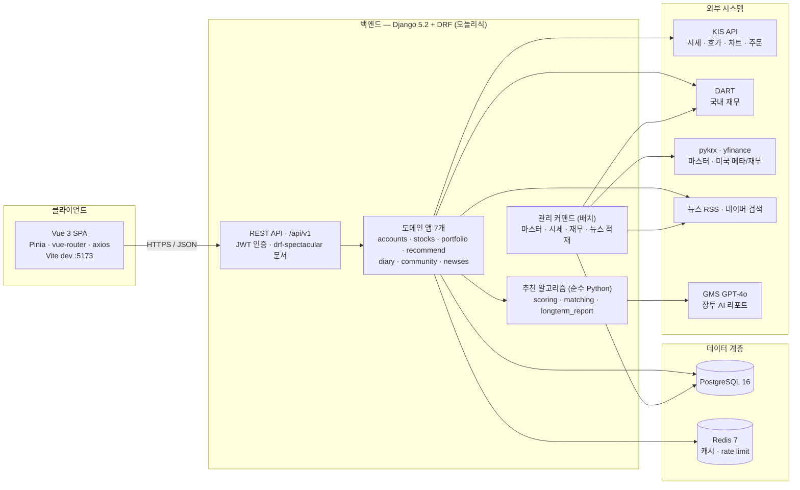
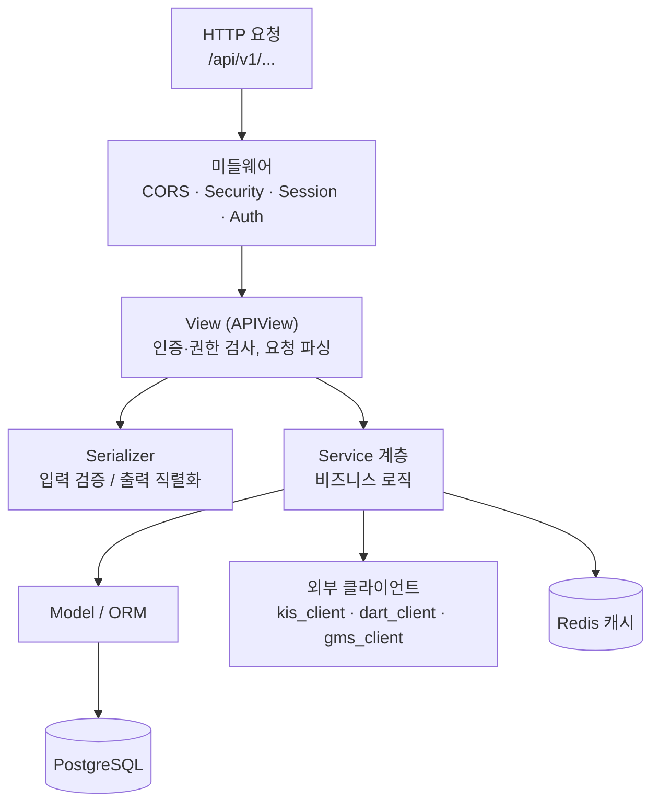
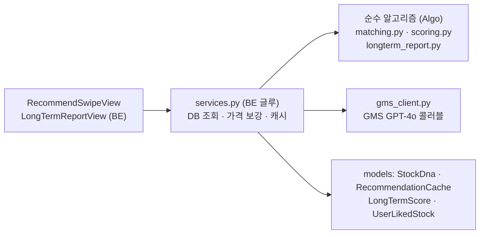

# 주만추(Jumanchu) — 서비스 아키텍처

> 데모(dev 브랜치) 기준 실제 구현 아키텍처. 코드와 어긋나면 **코드가 진실**이며 이 문서를 갱신한다.
> 관련 문서: 데이터 모델 → `docs/ERD.md`, 인증 정책 → `docs/인증_권한_정책.md`,
> API 명세 → `docs/API_스키마_v1.5.md`, 유스케이스 → `planning/모델_서비스flow/ucd_demo.puml`

---

## 1. 한눈에

**주린이용 주식 투자 학습 서비스.** 구조는 단순하고 명확하다 — **Vue 3 SPA**(프론트) ↔ **Django REST 모놀리식**(백엔드) ↔ **PostgreSQL/Redis** + **외부 금융·뉴스·AI API**.

- **아키텍처 스타일**: SPA + REST API 모놀리식 (마이크로서비스 아님 — 6주 팀 프로젝트 스코프에 맞춘 단일 Django 프로젝트, 도메인은 *앱*으로 분리)
- **통신**: 프론트/백엔드 완전 분리, JSON over HTTP. 백엔드는 화면을 렌더링하지 않고 데이터만 제공
- **외부 의존**: 가격은 **KIS API 단일 경로**(국내·해외 공통), 재무는 DART(국내)/yfinance(미국), AI는 SSAFY GMS(GPT-4o)

---

## 2. 시스템 구성도 (컨테이너)



핵심 포인트: **실시간 요청 경로**(앱 → 외부 API)와 **배치 적재 경로**(관리 커맨드 → 외부 API → DB)를 분리했다. 시세처럼 자주 바뀌는 값은 요청 시 KIS를 직접 호출(+짧은 캐시)하고, 종목 마스터·재무·뉴스처럼 무거운 데이터는 배치로 미리 DB에 적재한다.

---

## 3. 기술 스택

| 계층 | 기술 | 비고 |
|---|---|---|
| **Frontend** | Vue 3.5, Pinia 3, vue-router 5, axios 1.16, Vite 8 | SPA, `<script setup>` Composition API |
| **Backend** | Django 5.2, Django REST Framework 3.17 | 모놀리식, 도메인별 앱 분리 |
| **인증** | djangorestframework-simplejwt 5.5 | JWT (access Bearer + refresh 쿠키) |
| **API 문서** | drf-spectacular 0.28 | OpenAPI 3 자동 생성, Swagger/ReDoc |
| **DB** | PostgreSQL 16 | psycopg 3 드라이버 |
| **캐시/제한** | Redis 7 (django-redis 5.4, django-ratelimit 4.1) | 가격 캐시 + 로그인/가입 rate limit |
| **CORS** | django-cors-headers 4.9 | `localhost:5173` 허용, credentials 포함 |
| **데이터 처리** | pandas 3, numpy 2 | 지표 계산·재무 가공 |
| **외부 SDK** | yfinance 0.2, openai 2.24, lxml/requests | yfinance=메타/미국재무, openai=GMS 프록시 |
| **CI** | GitHub Actions | ruff lint · 마이그레이션 검사 · pytest |
| **인프라(로컬)** | Docker Compose | postgres:16 + redis:7-alpine |

> 가격 데이터는 **무조건 KIS API**. yfinance는 `industry`·`homepage_url` 같은 **메타데이터 보완용**으로만 쓴다(스크래핑 throttling으로 대량 적재가 불안정 + 한·미 출처 일관성).

---

## 4. 요청 처리 레이어 (백엔드 내부)



**레이어 책임 분리**가 이 백엔드의 핵심 설계다:

- **View** (`views.py`) — HTTP 경계. 인증·권한·상태코드만 담당, 로직은 service에 위임
- **Serializer** (`serializers.py`) — 요청 검증 / 응답 모양 고정
- **Service** (`services/`, `services.py`) — 실제 로직. 외부 API 호출·캐싱·예외 변환(예: KIS 실패 → 503)을 여기서 흡수
- **외부 클라이언트** (`stocks/services/kis_client.py`, `dart_client.py`, `recommend/gms_client.py`) — 외부 API 통신 캡슐화. 나머지 코드는 외부 API의 응답 포맷을 몰라도 됨

> 이 분리 덕분에 "한 종목 시세 조회가 실패해도 관심종목 목록 전체는 뜬다"(가격만 `None`) 같은 **부분 실패 허용**을 service 계층에서 일관되게 처리한다.

---

## 5. 도메인 앱 구성 (7개)

URL은 전부 `/api/v1/` 하위. 인증은 기본 `IsAuthenticated`, 공개 엔드포인트만 개별 허용.

| 앱 | 책임 | 주요 엔드포인트 | 외부 의존 |
|---|---|---|---|
| **accounts** | 회원·인증·온보딩 | `auth/signup·login·logout·me·onboarding` | — |
| **stocks** | 종목 정보·시세·재무·시장 | `stocks/*`, `markets/summary`, `economic-events` | KIS, DART, yfinance |
| **portfolio** | **모의투자**(주문·잔고·자산배분) | `orders/*`, `portfolio/*` | KIS(체결가) |
| **recommend** | 스와이프 추천·관심종목·장투 케어 | `recommendations`, `watchlist/*`, `longterm/*` | GMS(GPT-4o) |
| **diary** | 매매/관심 투자 일기 | `diaries/*` | — |
| **community** | 게시글·댓글·좋아요·팔로우 | `posts/*`, `comments/*`, `users/*/follow` | — |
| **newses** | 종목/경제/섹터 뉴스 | `news/*` | 뉴스 RSS, 네이버 검색 |

라우팅은 `config/urls.py`가 `api/v1/` 아래로 각 앱의 `urls.py`를 `include`. 인증만 `auth/` 프리픽스를 갖고 나머지는 루트에 합류한다.

---

## 6. BE ↔ Algo 경계 (추천 도메인)

추천은 팀 분담상 **Algo(정율)가 순수 Python 함수**를 만들고 **BE(강재민)가 view에서 호출**하는 구조다. `recommend/` 앱 안에서 역할이 파일로 분리돼 있다:



- **순수 알고리즘** (`matching.py`, `scoring.py`, `longterm_report.py`) — Django 비의존. 입력 dataclass → 출력 dataclass. 단위 테스트 쉬움
- **BE 글루** (`services.py`, `views.py`) — DB에서 사용자 성향·종목 DNA를 읽어 알고리즘에 넣고, 결과를 REST 응답으로 변환. 결과는 `RecommendationCache`로 캐싱
- **LLM 호출** (`gms_client.py`) — OpenAI SDK를 SSAFY GMS 프록시(`gms.ssafy.io`)로 향하게 한 GPT-4o 콜러블. 장투 케어 AI 리포트에만 사용. 지연 import라 리포트를 안 쓰는 경로는 openai 미설치여도 동작

> 종목 추천 후보 산출은 **룰베이스 매칭**(투자성향 ↔ 종목 위험성향/섹터 가중치)이다. 협업필터링·ML은 스코프 외.

---

## 7. 외부 연동 & 캐싱 전략

| 외부 | 용도 | 호출 경로 | 캐싱 |
|---|---|---|---|
| **KIS API** | 현재가·호가·차트·시장지수·**모의주문 체결가** | 실시간(요청 시) | 장중 **3초** / 장외 **60초** TTL |
| **DART** | 국내 기업 재무제표 | 배치(`enrich_financials`) | DB 적재 후 재사용 |
| **yfinance·pykrx** | 종목 마스터·미국 메타/재무 | 배치(`sync_*`, `enrich_*`) | DB 적재 |
| **뉴스 RSS·네이버 검색** | 경제/섹터/종목 뉴스 | 배치(`ingest_rss`) + 실시간 검색 | `FeedNews` DB + 응답 캐시 |
| **GMS GPT-4o** | 장투 케어 AI 리포트 | 실시간(요청 시) | 리포트 결과 저장 |

**캐싱 계층:**
- **Redis** — `django-ratelimit`의 원자적 카운터(로그인/가입/비번재설정 무차별 대입 방어)와 가격 캐시 백엔드
- **DB 캐시** — `RecommendationCache`(추천 결과), `StockPrice`/`FinancialSummary`/`StockIndicator`(적재 데이터)
- **부분 실패 허용** — 외부 API 실패 시 마지막 캐시값 반환 + 안내. 시세 조회 실패는 해당 항목만 `None`, 목록은 정상

---

## 8. 데이터 계층 (주요 엔티티)

도메인별 핵심 모델(상세는 `docs/ERD.md`):

| 도메인 | 모델 |
|---|---|
| **계정** | `User`(커스텀, AbstractUser 상속), `InvestmentProfile`, `Goal`/`UserGoal`, `UserPreferredSector` |
| **종목** | `Stock`, `StockPrice`, `StockIndicator`, `FinancialSummary`, `StockNews`/`NewsRelatedStock`, `EconomicEvent` |
| **모의투자** | `Account`(가상 계좌), `Holding`(보유), `Order`(주문) |
| **추천** | `StockDna`(종목 성향 벡터), `RecommendationCache`, `LongTermScore`, `UserLikedStock`(관심), `HoldingMilestone` |
| **커뮤니티** | `CommunityPost`, `Comment`, `PostLike`/`CommentLike`, `Follow` |
| **일기** | `StockDiary`, `DiaryReview` |
| **뉴스** | `FeedNews`, `NewsSector` |

---

## 9. 인증 · 보안

상세 정책은 `docs/인증_권한_정책.md`. 요약:

- **JWT (simplejwt)** — access **30분**(Authorization Bearer), refresh **14일**(`HttpOnly` 쿠키, path `/api/v1/auth/`)
- **refresh 회전 + 블랙리스트** — 갱신 시마다 새 refresh 발급, 이전 토큰은 `token_blacklist`로 폐기 → 탈취 토큰 재사용 차단
- **rate limit** — 로그인/가입/비밀번호 재설정에 `django-ratelimit`(Redis 카운터). 무차별 대입 방어
- **권한 기본값** — DRF `IsAuthenticated`. 공개 엔드포인트(종목 조회·뉴스·시장요약·글 조회)만 개별 허용
- **CORS** — `localhost:5173`(Vite) 출처만, `CORS_ALLOW_CREDENTIALS=True`(쿠키 전송)
- **비밀번호** — Django 기본 validator 4종(유사도·최소길이·흔한 비번·숫자전용) + 해시 저장

> ⚠️ 데모 설정 주의: `settings.py`의 `SECRET_KEY`·`DEBUG=True`는 개발용. 운영 배포 시 환경변수 분리 필요.

---

## 10. 배치 / 데이터 파이프라인 (관리 커맨드)

무거운 데이터는 `python manage.py <command>`로 적재·갱신한다:

| 커맨드 | 역할 |
|---|---|
| `sync_stock_master` / `sync_us_stock_master` | 국내/미국 종목 마스터 적재 |
| `enrich_stock_meta_from_kis` / `_from_dart` / `enrich_us_stock_meta` | 종목 메타데이터 보강 |
| `enrich_financials` | 재무제표 적재(DART/yfinance) |
| `sync_stock_prices` | 시세 적재 |
| `calc_market_indicators` / `normalize_sectors` / `sync_us_index_flags` | 지표 계산·섹터 정규화·지수 플래그 |
| `seed_economic_events` | 경제 캘린더 시드 |
| `calc_stock_dna` / `calc_longterm_scores` | 추천용 종목 DNA·장투 점수 산출 |
| `ingest_rss` | 뉴스 RSS 수집 |

---

## 11. 인프라 · 배포 · 협업

**로컬 실행 (Docker Compose)** — PostgreSQL 16 + Redis 7만 컨테이너로, Django/Vite는 호스트에서 실행:

```bash
docker compose up -d            # db(pg16) + redis(7-alpine) 기동
cd backend && python manage.py migrate && python manage.py runserver
cd frontend && npm run dev       # Vite :5173
```

**API 문서** (drf-spectacular 자동 생성):
- 스키마: `GET /api/schema/`
- Swagger UI: `GET /api/docs/`
- ReDoc: `GET /api/redoc/`

**CI/CD** (`.github/workflows/ci.yml`) — push/PR(main·develop)에서:
- **Backend**: ruff lint → `makemigrations --check`(누락 마이그레이션 차단) → `manage.py check` → pytest
- **Frontend**: lint → type-check → build → test
- 동일 브랜치 중복 실행은 `concurrency`로 취소

**팀 분담 (3인)** — BE(강재민): Django 전부·외부 연동·CI / Algo(정율): 순수 Python 추천 함수 / FE(송호영): Vue 전부.

---

## 부록. 디렉토리 구조 (백엔드)

```
backend/
├── config/                 # settings, urls(api/v1), wsgi/asgi
├── accounts/               # 회원·인증·온보딩
├── stocks/
│   ├── services/           # kis_client · dart_client · financials · price_dispatch · market_summary
│   └── management/commands # 마스터·시세·재무·지표 배치
├── portfolio/              # 모의투자 (Account·Holding·Order)
├── recommend/
│   ├── matching·scoring·longterm_report.py   # 순수 알고리즘 (Algo)
│   ├── gms_client.py       # GMS GPT-4o 콜러블
│   └── services.py·views.py # BE 글루
├── diary/                  # 투자 일기
├── community/              # 게시글·댓글·팔로우
└── newses/                 # 뉴스 (rss.py · ingest_rss 커맨드)
```
```
frontend/  (Vue 3 SPA — Pinia · vue-router · axios · Vite)
```
